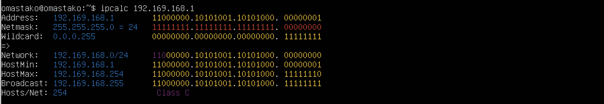
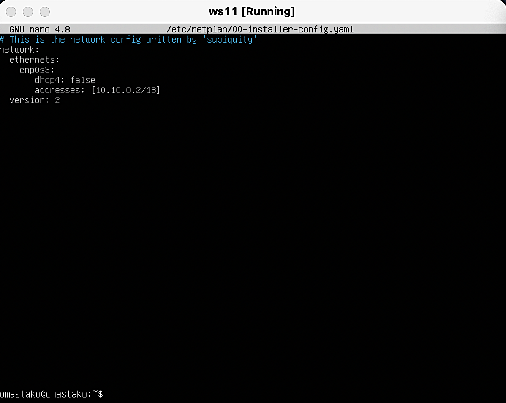
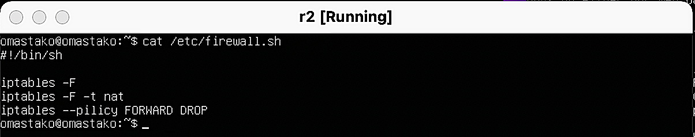

## Part 1. Инструмент ipcalc
----
* ipcalc - выполняет простые операции с IP-адресами  
Для установки утилиты ipcalc следует ввести следующую команду:
`sudo apt install ipcalc`


#### 1.1. Сети и маски
##### 1) Определяем адрес сети 192.167.38.54/13 с помощью команды
`ipcalc 192.167.38.54/13`

##### 2) Перевод маски:
`ipcalc 192.167.38.54/255.255.255.0`
- префиксная форма записи /24
- двоичная форма записи 11111111.11111111.11111111.00000000

`ipcalc 192.167.38.54/15`
- обычная форма записи 255.254.0.0
- двоичная 11111111.1111111 0.00000000.00000000

`ipcalc 192.167.38.54/11111111.11111111.11111111.11110000`


##### 3) минимальный и максимальный хост в сети *12.167.38.4* при масках: 
`ipcalc 12.167.38.4/8`
- минимальный хост 12.0.0.1
- максимальный хост 12.255.255.254

`ipcalc 12.167.38.4/11111111.11111111.00000000.00000000`
- минимальный хост 12.167.38.1
- максимальный хост 12.167.38.254

`ipcalc 12.167.38.4/16`
- минимальный хост 12.167.0.1
- максимальный хост 12.167.255.254

`ipcalc 12.167.38.4/255.255.254.0`
- минимальный хост 12.167.38.1
- максимальный хост 12.167.38.254

`ipcalc 12.167.38.4/23`
- минимальный хост 12.167.38.1
- максимальный хост 12.167.39.254

`ipcalc 12.167.38.4/4`
- минимальный хост 0.0.0.1
- максимальный хост 15.255.255.254


#### 1.2. localhost
##### Определить и записать в отчёт, можно ли обратиться к приложению, работающему на localhost, со следующими IP: *194.34.23.100*, *127.0.0.2*, *127.1.0.1*, *128.0.0.1*
- приложения к которым можно обратиться через localhost: 127.0.0.2, 127.1.0.1
`ipcalc 127.0.0.2`

`ipcalc 127.1.0.2`

- приложения к которым нельзя обратиться через localhost: 194.34.23.100, 128.0.0.1
`ipcalc 194.34.23.100`

`ipcalc 128.0.0.1`


#### 1.3. Диапазоны и сегменты сетей
##### 1) какие из перечисленных IP можно использовать в качестве публичного, а какие только в качестве частных: *10.0.0.45*, *134.43.0.2*, *192.168.4.2*, *172.20.250.4*, *172.0.2.1*, *192.172.0.1*, *172.68.0.2*, *172.16.255.255*, *10.10.10.10*, *192.169.168.1*
Публичный IP адрес - называется IP адрес, который используется для выхода в Интернет. Частный IP адрес - адреса, используемые в локальных сетях (не может быть напрямую подключен к Интернету).
- к публичным относятся следующие IP адреса: 172.0.2.1, 192.172.0.1, 172.68.0.2, 192.169.168.1, 134.43.0.2.




- к частным относятся следующие IP адреса: 10.0.0.45, 192.168.4.2, 172.20.250.4, 172.16.255.255, 10.10.10.10


##### 2) какие из перечисленных IP адресов шлюза возможны у сети *10.10.0.0/18*: *10.0.0.1*, *10.10.0.2*, *10.10.10.10*, *10.10.100.1*, *10.10.1.255*
`-`10.10.0.2 
`-`10.10.10.10 
`-`10.10.1.255


## Part 2. Статическая маршрутизация между двумя машинами
#### Поднять две виртуальные машины (далее -- ws1 и ws2)
#### С помощью команды ip a посмотреть существующие сетевые интерфейсы


#####1) lo или local loopback (локальная петля). Служит для подключения по сети к этому же компьютеру и не требует дополнительной настройки;
``` brew
* ws1: 127.0.0.1/8;
* ws2: 127.0.0.1/8;
```
##### 2) enp0s3 - первый сетевой адаптер работающий в NAT режиме. 
``` brew
* ws1: 10.0.2.15/24;
* ws2: 10.0.2.15/24.
```
#### Описать сетевой интерфейс, соответствующий внутренней сети, на обеих машинах и задать следующие адреса и маски: 
``` brew 
ws1 - 192.168.100.10, маска /16,
ws2 - 172.24.116.8, маска /12           
sudo vim /etc/netplan/00-installer-config.yaml
```
#### Выполнить команду netplan apply для перезапуска сервиса сети
`netplan apply`


### Добавление статического маршрута вручную
#### Добавить статический маршрут от одной машины до другой и обратно при помощи команды вида ip r add
``` brew 
sudo ip r add 172.24.116.8 dev enp0s3//ws1
sudo ip r add 192.168.100.10 dev enp0s3//ws2
```
#### Пропинговать соединение между машинами
``` brew
ping 172.24.116.8 //ws1
ping 192.168.100.10 //ws2
```


### Добавление статического маршрута с сохранением
#### Перезапустить машины
`sudo netplan apply`
#### Добавить статический маршрут от одной машины до другой с помощью файла etc/netplan/00-installer-config.yaml
`sudo vim /etc/netplan/00-installer-config.yaml`

#### Пропинговать соединение между машинами


## Part 3. Утилита **iperf3**
### Скорость соединения
Перевести и записать в отчёт: 8 Mbps в MB/s, 100 MB/s в Kbps, 1 Gbps в Mbps
``` brew
8Mbps == 1MB/s;
100MB/s == 819200 Kbps;
1Gbps == 1024 Mbps.
``` 
### Утилита iperf3
Измерить скорость соединения между ws1 и ws2:


## Part 4. Сетевой экран
### Утилита iptables
Создать файл /etc/firewall.sh, имитирующий фаерволл, на ws1 и ws2.
Нужно добавить в файл подряд следующие правила:
1) на ws1 применить стратегию когда в начале пишется запрещающее правило, а в конце пишется разрешающее правило (это касается пунктов 4 и 5)
2) на ws2 применить стратегию когда в начале пишется разрешающее правило, а в конце пишется запрещающее правило (это касается пунктов 4 и 5)
3) открыть на машинах доступ для порта 22 (ssh) и порта 80 (http)
4) запретить echo reply (машина не должна "пинговаться”, т.е. должна быть блокировка на OUTPUT)
5) разрешить echo reply (машина должна "пинговаться")
- ws1:

- ws2:

Запустить файлы на обеих машинах командами chmod +x /etc/firewall.sh и /etc/firewall.sh
- ws1:

- ws2:

- Разница между стратегиями заключается в том, что в первом файле первым подходящим правилом для пакета является запрет, а во втором - разрешение. Применяется только первое подходящее правило, остальные игнорируются.
### Утилита nmap
Командой ping найти машину, которая не "пингуется", после чего утилитой nmap показать, что хост машины запущен


* Видно из скрина что, хост 1ой машины запущен, но не пингуется

## Part 5. Статическая маршрутизация сети
Поднять пять виртуальных машин (3 рабочие станции (ws11, ws21, ws22) и 2 роутера (r1, r2))

### Настройка адресов машин
Настроить конфигурации машин в etc/netplan/00-installer-config.yaml согласно сети на рисунке.



Перезапустить сервис сети. Если ошибок нет, то командой ip -4 a проверить, что адрес машины задан верно. Также пропинговать ws22 с ws21. Аналогично пропинговать r1 с ws11.
* ip -4 a


* пропинговать ws22 с ws21

* пропинговать r1 с ws11

### Включение переадресации IP-адресов.
Для включения переадресации IP, выполните команду на роутерах:
* sysctl -w net.ipv4.ip_forward=1


Откройте файл /etc/sysctl.conf и добавьте в него следующую строку:
* net.ipv4.ip_forward = 1


### Установка маршрута по-умолчанию
Настроить маршрут по-умолчанию (шлюз) для рабочих станций. Для этого добавить gateway4 [ip роутера] в файле конфигураций
Вызвать ip r и показать, что добавился маршрут в таблицу маршрутизации
* ip r


Пропинговать с ws11 роутер r2 и показать на r2, что пинг доходит. Для этого использовать команду:
* tcpdump -tn -i eth1


### Добавление статических маршрутов
Добавить в роутеры r1 и r2 статические маршруты в файле конфигураций.


Вызвать ip r и показать таблицы с маршрутами на обоих роутерах. Пример таблицы на r1:
* ip r


Запустить команды на ws11:
``` brew
ip r list 10.10.0.0/[18]
ip r list 0.0.0.0/0
```

Для адреса 10.10.0.0/18 был выбран маршрут, отличный от 0.0.0.0/0, поскольку он является адресом сети и доступен без шлюза.
### Построение списка маршрутизаторов
Запустить на r1 команду дампа
* tcpdump -tnv -i eth0
При помощи утилиты traceroute построить список маршрутизаторов на пути от ws11 до ws21


Для определения промежуточных маршрутизаторов traceroute отправляет целевому узлу серию ICMP-пакетов (по умолчанию 3 пакета), с каждым шагом увеличивая значение поля TTL («время жизни») на 1. Это поле обычно указывает максимальное количество маршрутизаторов, которое может быть пройдено пакетом. Первая серия пакетов отправляется с TTL, равным 1, и поэтому первый же маршрутизатор возвращает обратно ICMP-сообщение «time exceeded in transit», указывающее на невозможность доставки данных. Traceroute фиксирует адрес маршрутизатора, а также время между отправкой пакета и получением ответа (эти сведения выводятся на монитор компьютера). Затем traceroute повторяет отправку серии пакетов, но уже с TTL, равным 2, что заставляет первый маршрутизатор уменьшить TTL пакетов на единицу и направить их ко второму маршрутизатору. Второй маршрутизатор, получив пакеты с TTL=1, так же возвращает «time exceeded in transit».

Процесс повторяется до тех пор, пока пакет не достигнет целевого узла, тем самым увеличивая значение ttl. При получении ответа от этого узла процесс трассировки считается завершённым.
### Использование протокола ICMP при маршрутизации
Запустить на r1 перехват сетевого трафика, проходящего через eth0 с помощью команды:
``` brew
tcpdump -n -i eth0 icmp
```
Пропинговать с ws11 несуществующий IP (например, 10.30.0.111) с помощью команды:
* ping -c 1 10.30.0.111


## Part 6. Динамическая настройка IP с помощью **DHCP**
Для r2 настроить в файле /etc/dhcp/dhcpd.conf конфигурацию службы DHCP:
1) указать адрес маршрутизатора по-умолчанию, DNS-сервер и адрес внутренней сети. 

2) в файле resolv.conf прописать nameserver 8.8.8.8.

Перезагрузить службу DHCP командой systemctl restart isc-dhcp-server. Машину ws21 перезагрузить при помощи reboot и через ip a показать, что она получила адрес. Также пропинговать ws22 с ws21.
* systemctl restart isc-dhcp-server // r2

``` brew
reboot // ws21
ip a // ws 21
```

Указать MAC адрес у ws11, для этого в etc/netplan/00-installer-config.yaml надо добавить строки: macaddress: 10:10:10:10:10:BA, dhcp4: true

Для r1 настроить аналогично r2, но сделать выдачу адресов с жесткой привязкой к MAC-адресу (ws11). Провести аналогичные тесты
В файле /etc/dhcp/dhcpd.conf настроить конфигурацию службы DHCP с жесткой привязкой к MAC-адресу (ws11)

в файле resolv.conf прописать nameserver 8.8.8.8 (DNS)

Перезагрузить службу DHCP командой systemctl restart isc-dhcp-server. Машину ws11 перезагрузить при помощи reboot и через ip a показать, что она получила адрес.
* systemctl restart isc-dhcp-server // r1

``` brew
reboot // ws11
ip a // ws 11
```

Запросить с ws21 обновление ip адреса
В отчёте поместить скрины ip до и после обновления
* До обновления

Обновление с помощью следующих команд:
``` brew
sudo dhclient -r enp0s3
sudo dhclient enp0s3
```
* После обноваления


## Part 7. **NAT**
В файле /etc/apache2/ports.conf на ws22 и r1 изменить строку Listen 80 на Listen 0.0.0.0:80, то есть сделать сервер Apache2 общедоступным


Запустить веб-сервер Apache командой service apache2 start на ws22 и r1


Добавить в фаервол, созданный по аналогии с фаерволом из Части 4, на r2 следующие правила:
1) Удаление правил в таблице filter - iptables -F
2) Удаление правил в таблице "NAT" - iptables -F -t nat
3) Отбрасывать все маршрутизируемые пакеты - iptables --policy FORWARD DROP

Запускать файл также, как в Части 4
Проверить соединение между ws22 и r1 командой ping
При запуске файла с этими правилами, ws22 не должна "пинговаться" с r1


Добавить в файл ещё одно правило:
4) Разрешить маршрутизацию всех пакетов протокола ICMP

Запускать файл также, как в Части 4
Проверить соединение между ws22 и r1 командой ping
При запуске файла с этими правилами, ws22 должна "пинговаться" с r1


Добавить в файл ещё два правила:
5) Включить SNAT, а именно маскирование всех локальных ip из локальной сети, находящейся за r2 (по обозначениям из Части 5 - сеть 10.20.0.0)
6) Включить DNAT на 8080 порт машины r2 и добавить к веб-серверу Apache, запущенному на ws22, доступ извне сети
6) Включить DNAT на 8080 порт машины r2 и добавить к веб-серверу Apache, запущенному на ws22, доступ извне сети

Проверить соединение по TCP для SNAT, для этого с ws22 подключиться к серверу Apache на r1 командой:
* telnet 10.100.0.11 80

Проверить соединение по TCP для DNAT, для этого с r1 подключиться к серверу Apache на ws22 командой telnet (обращаться по адресу r2 и порту 8080)
* telnet 10.100.0.12 8080


## Part 8. Дополнительно. Знакомство с **SSH Tunnels**
Запустить веб-сервер Apache на ws22 только на localhost (то есть в файле /etc/apache2/ports.conf изменить строку Listen 80 на Listen localhost:80)

Воспользоваться Local TCP forwarding с ws21 до ws22, чтобы получить доступ к веб-серверу на ws22 с ws21


Воспользоваться Remote TCP forwarding c ws11 до ws22, чтобы получить доступ к веб-серверу на ws22 с ws11

Для проверки, сработало ли подключение в обоих предыдущих пунктах, перейдите во второй терминал (например, клавишами Alt + F2) и выполните команду:


